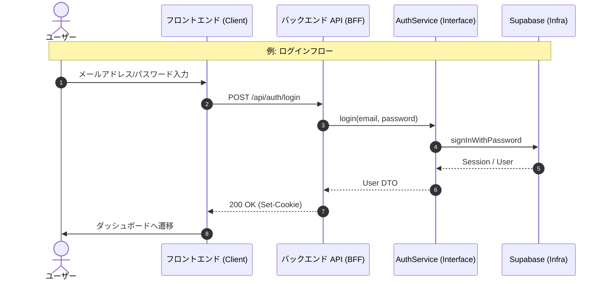

# 認証 API 詳細設計

## 概要

認証機能は Supabase Auth を利用するが、ベンダー非依存性を確保するため、クライアントは直接 Supabase SDK を使用せず、必ず本 API (BFF) を経由する。

## エンドポイント

| メソッド | パス | 概要 |
| --- | --- | --- |
| POST | `/api/auth/signup` | 新規ユーザー登録を行う。 |
| POST | `/api/auth/login` | ログインを行い、セッションCookieを発行する。 |
| POST | `/api/auth/logout` | ログアウトし、セッションを破棄する。 |
| GET | `/api/auth/me` | 現在のログインユーザー情報を取得する。 |
| DELETE | `/api/auth/user` | アカウントを削除する（退会）。 |

## データフロー

## 各エンドポイント詳細

### `POST /api/auth/signup`
- **Request**: `{ "email": "...", "password": "...", "displayName": "..." }`
- **Response**: `{ "id": "uuid", "email": "...", "created_at": "..." }`

### `DELETE /api/auth/user`
- **概要**: ログイン中のユーザー自身を削除する。これに伴い、`search_histories` などの関連データも削除される（Cascade設定またはService層での削除）。

