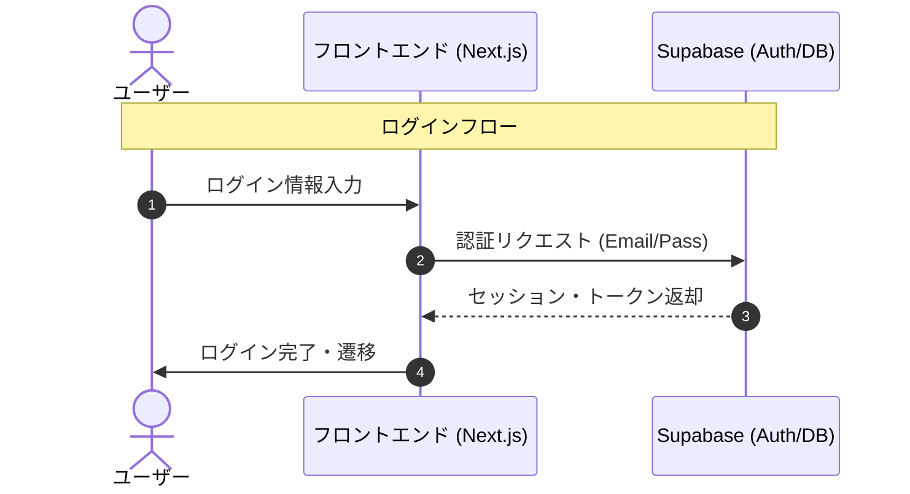

# 認証 API 詳細設計

## エンドポイント

`POST /api/auth/login`

- **概要**: ユーザー認証を行い、セッションを確立する。

## データフロー

```mermaid
sequenceDiagram
    autonumber
    actor User as ユーザー
    participant Client as フロントエンド (Next.js)
    participant Supabase as Supabase (Auth/DB)

    Note over User, Supabase: ログインフロー
    User->>Client: ログイン情報入力
    Client->>Supabase: 認証リクエスト (Email/Pass)
    Supabase-->>Client: セッション・トークン返却
    Client->>User: ログイン完了・遷移
```
