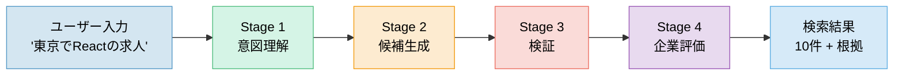
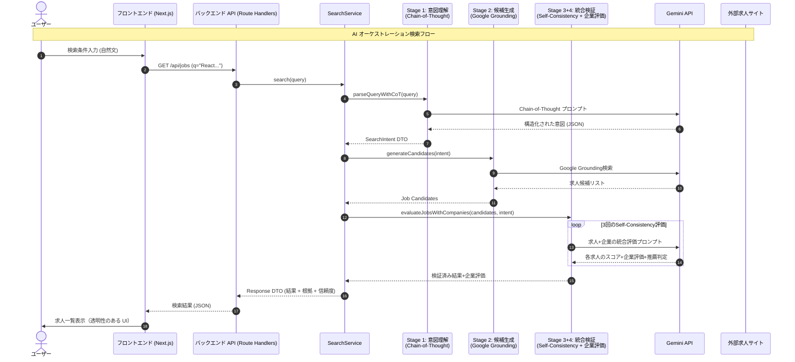

# 求人検索 API 詳細設計

## エンドポイント

`GET /api/jobs`

- **概要**: 求人情報を一覧取得する。
- **パラメータ**:
  - `q` (string, optional): 自然文検索クエリ。
  - `locations` (string[], optional): 勤務地フィルタ。
  - `skills` (string[], optional): スキルタグフィルタ。
  - `min_salary` (integer, optional): 最低年収。
  - `work_styles` (string[], optional): 働き方 (Remote, Flex etc)。
  - `offset` (integer, default: 0): ページネーション用。
  - `limit` (integer, default: 20): 1回あたりの取得件数。

## レスポンススキーマ (Job List)

```json
{
  "total": 100,
  "data": [
    {
      "id": "uuid",
      "title": "Frontend Engineer",
      "company": "Tech Corp",
      "location": "Tokyo",
      "salary": "800万 - 1000万",
      "tags": ["React", "TypeScript"],
      "work_styles": ["Remote"],
      "created_at": "2024-01-01T00:00:00Z"
    }
  ]
}
```

---

## システム概要図（シンプル版）



### 各ステージの詳細

#### Stage 1: 意図理解（Chain-of-Thought）
- **入力**: 「東京でReactの求人」
- **処理**: AIが段階的思考で要望を深く分析
  - 明示的条件: 「東京」「React」を抽出
  - 暗黙的条件: 「年収600-900万」「スタートアップまたはメガベンチャー」を推論
  - 優先度分類: 必須条件と希望条件に分類
- **出力**: 構造化された検索意図（JSON）

#### Stage 2: AI求人候補生成
- **入力**: Stage 1の検索意図（構造化データ全体）
- **処理**: Geminiがユーザーの条件（明示的・暗黙的条件全て）を解釈し、マッチする求人候補を生成
  - 完全無料
  - 架空の求人だが、条件に完全マッチ
  - 「Full Remote」や「副業可」などの細かいニュアンスも反映
- **出力**: 求人候補リスト（**10件程度**）

#### Stage 3+4: 統合検証（Self-Consistency + 企業評価）
- **入力**: 候補求人リスト + Stage 1 で抽出したユーザーの検索意図
- **処理**: 同じ質問・同じ条件で候補リスト全体を3回評価し、推論結果の多数派を採用
  - 同じプロンプトを3回実行（温度パラメータにより出力が変わる）
  - 各求人について「求人内容のマッチ度」+「企業評価（ユーザー関心事項）」を同時に評価
  - 3回中2回以上「推薦する」と判定された求人のみを採用（多数決）
  - これにより、AIの偶発的な誤判定を排除し、企業評価も含めた総合的な信頼度を確保
- **出力**: 検証済み求人リスト（10-20件） + 信頼度スコア（一致率: 67% or 100%） + 企業評価

---

## データフロー（詳細版）





## AI クエリ解析ロジック

Gemini API を使用して、ユーザーの自然文入力をデータベース検索可能な構造化データ (JSON) に変換する。

### 1. プロンプト戦略

- **役割 (Role)**:
  - あなたは優秀なIT専門の採用担当者兼データアナリストです。
  - ユーザーの曖昧な要望から、具体的な検索条件を推論・抽出することが求められます。

- **タスク**:
  - ユーザーの入力文を解析し、後述する JSON スキーマに従って検索条件を出力してください。
  - 推論できない項目は `null` または空配列としてください。嘘のデータを生成してはいけません。

- **入力例と出力例 (Few-Shot)**:

  **User**: "東京で働きたい。年収は800万以上。Reactが得意です。"
  **Output**:
  ```json
  {
    "locations": ["Tokyo"],
    "min_salary": 8000000,
    "skills": ["React"],
    "employment_type": null
  }
  ```

  **User**: "リモート可で、スタートアップ企業。ジュニアレベルでもOKなところ"
  **Output**:
  ```json
  {
    "remote_available": true,
    "company_characteristics": ["Startup"],
    "experience_level": ["Junior", "Entry"],
    "min_salary": null
  }
  ```

### 2. 出力スキーマ (JSON)

Gemini からのレスポンスは以下の構造を期待する。

```json
{
  "type": "object",
  "properties": {
    "keywords": {
      "type": "array",
      "items": { "type": "string" },
      "description": "フリーワード検索用のキーワード (企業名、特殊な技術など)"
    },
    "locations": {
      "type": "array",
      "items": { "type": "string" },
      "description": "勤務地 (都道府県または主要都市)"
    },
    "min_salary": {
      "type": "integer",
      "nullable": true,
      "description": "最低年収 (日本円)"
    },
    "max_salary": {
      "type": "integer",
      "nullable": true,
      "description": "最高年収 (日本円)"
    },
    "skills": {
      "type": "array",
      "items": { "type": "string" },
      "description": "プログラミング言語、フレームワーク、ツール等"
    },
    "employment_type": {
      "type": "array",
      "items": { "type": "string", "enum": ["Full-time", "Contract", "Freelance", "Part-time"] },
      "description": "雇用形態"
    },
    "remote_available": {
      "type": "boolean",
      "nullable": true,
      "description": "リモートワーク可否"
    },
    "experience_level": {
      "type": "array",
      "items": { "type": "string", "enum": ["Junior", "Middle", "Senior", "Lead"] },
      "description": "求められる経験レベル"
    },
    "company_characteristics": {
      "type": "array",
      "items": { "type": "string" },
      "description": "企業の特徴 (e.g., Startup, Enterprise, Foreign, IPO)"
    }
  }
}
```

### 3. マッピング処理 (Logic Layer)

AIから返却された JSON を Supabase クエリに変換する。

- `locations`: `jobs.location` カラムに対して `ILIKE` または `IN` 検索。
- `min_salary`: `jobs.salary_min >= value`
- `skills`: `jobs.skills` (Array/JSONB) カラムに対して `contains` 検索。
- `company_characteristics`: `companies.tags` との照合など。

**必須フィルタ (鮮度保証)**:
すべての検索クエリに対して、以下の条件を強制的に適用する。

```sql
WHERE is_active = true 
  AND crawled_at > (NOW() - INTERVAL '30 days')
ORDER BY crawled_at DESC
```

### 4. 検索履歴の保存 (Side Effect)

ユーザーがログインしている場合、検索実行時 (`GET /api/jobs`) に以下の処理を非同期で行う。

1. **保存**: カレントユーザーID、検索条件 (JSON)、サマリーを `search_histories` テーブルに保存する。
2. **自動削除**: 保存後、当該ユーザーの履歴が **10件** を超える場合、古い履歴 (`created_at` が古い順) を削除する。

---

## 関連エンドポイント

### `GET /api/history`

- **概要**: ログインユーザーの過去の検索履歴を取得する（最大10件）。
- **レスポンス例**:
  ```json
  [
    {
      "id": "uuid-1",
      "summary": "東京, >800万, React",
      "conditions": { "locations": ["Tokyo"], "min_salary": 8000000, "skills": ["React"] },
      "created_at": "2024-01-01T10:00:00Z"
    },
    ...
  ]
  ```

## 用語集 (Terminology)

### Chain-of-Thought (思考の連鎖)
AIに対して「ステップバイステップで考えて」と指示することで、複雑な推論の精度を向上させるプロンプトエンジニアリング手法。
単に答えを求めるのではなく、中間的な思考プロセスを出力させることで、論理的な誤りを減らすことができます。(Wei et al., 2022)

### Function Calling (関数呼び出し) → Google Search Grounding
当初は「関数呼び出し」で特定のサイトを検索する予定でしたが、「あらゆるサイトから検索したい」という要件に合わせて、**Google Search Grounding**（GeminiのWeb検索機能）に変更しました。
AIが検索クエリ（例: `"React 求人 東京"`）を生成し、Google検索を通じてWeb上のあらゆる求人ページを見つけ出します。これにより、特定の求人サイトへの依存やバイアスを排除します。

### Self-Consistency (自己無撞着性)
同じプロンプトに対して複数回の推論を行い、その結果の多数決（または最も整合性の取れた回答）を採用する手法。
AIの出力にはランダム性があるため、1回だけの出力よりも、複数回試行して共通する結論を採用する方が信頼性が高まります。(Wang et al., 2022)

### ユーザー意図に基づく動的評価
**ユーザーの検索条件（Stage 1で抽出）**に基づいて、企業を評価する手法。

従来の画一的な評価（全企業を同じ項目で評価）ではなく、ユーザーが気にしている項目だけに焦点を当てて評価します。
例えば、「残業が少ない企業」を探しているユーザーには「残業時間」について詳しく評価し、「リモートワーク可」を探しているユーザーには「働き方の柔軟性」について評価します。

**多角的評価**: 各項目について、2つの異なる観点（直接的評価・批判的検証）から評価し、結果を統合することで信頼性を高めます。

これにより、ユーザーにとって本当に重要な情報だけを提供でき、評価の精度と関連性が向上します。


## AI API 実行回数制限 (API Usage Limits)

本システムでは、コストとパフォーマンスを最適化するため、1回の検索リクエストあたりのAI API実行回数に厳格な上限を設ける。

**1リクエストあたりの最大実行回数: 5回（すべて Gemini API、完全無料）**

| ステージ | 実行内容 | 回数 | 備考 |
|---|---|---|---|
| **Stage 1** | 意図理解 | **1回** | Gemini: ユーザー入力を解析 |
| **Stage 2** | 候補生成 | **1回** | Gemini: 検索クエリ生成 + Google検索実行（Grounding） |
| **Stage 3+4** | 統合検証（Self-Consistency + 企業評価） | **3回** | Gemini: 同じ条件で3回評価（求人+企業を総合的に判定） |
| **合計** | | **5回** | すべて無料の Gemini API |

※ 候補数（N）や企業数が増えても実行回数は変わらない（トークン数は増えるが、回数は固定）。
※ キャッシュヒット時はさらに回数が減る（Stage 3+4 はスキップ可能）。
