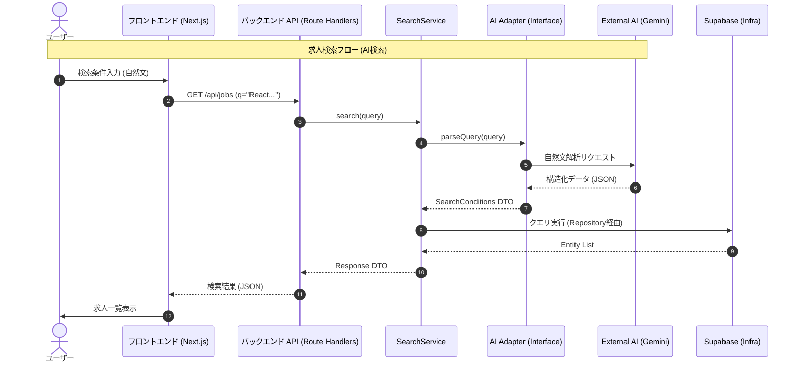

# 求人検索 API 詳細設計

## エンドポイント

`GET /api/jobs`

- **概要**: 求人情報を一覧取得する。
- **パラメータ**:
  - `q` (string, optional): 自然文検索クエリ。
  - `locations` (string[], optional): 勤務地フィルタ。
  - `skills` (string[], optional): スキルタグフィルタ。
  - `min_salary` (integer, optional): 最低年収。
  - `work_styles` (string[], optional): 働き方 (Remote, Flex etc)。
  - `offset` (integer, default: 0): ページネーション用。
  - `limit` (integer, default: 20): 1回あたりの取得件数。

## レスポンススキーマ (Job List)

```json
{
  "total": 100,
  "data": [
    {
      "id": "uuid",
      "title": "Frontend Engineer",
      "company": "Tech Corp",
      "location": "Tokyo",
      "salary": "800万 - 1000万",
      "tags": ["React", "TypeScript"],
      "work_styles": ["Remote"],
      "created_at": "2024-01-01T00:00:00Z"
    }
  ]
}
```

## データフロー



## AI クエリ解析ロジック

Gemini API を使用して、ユーザーの自然文入力をデータベース検索可能な構造化データ (JSON) に変換する。

### 1. プロンプト戦略

- **役割 (Role)**:
  - あなたは優秀なIT専門の採用担当者兼データアナリストです。
  - ユーザーの曖昧な要望から、具体的な検索条件を推論・抽出することが求められます。

- **タスク**:
  - ユーザーの入力文を解析し、後述する JSON スキーマに従って検索条件を出力してください。
  - 推論できない項目は `null` または空配列としてください。嘘のデータを生成してはいけません。

- **入力例と出力例 (Few-Shot)**:

  **User**: "東京で働きたい。年収は800万以上。Reactが得意です。"
  **Output**:
  ```json
  {
    "locations": ["Tokyo"],
    "min_salary": 8000000,
    "skills": ["React"],
    "employment_type": null
  }
  ```

  **User**: "リモート可で、スタートアップ企業。ジュニアレベルでもOKなところ"
  **Output**:
  ```json
  {
    "remote_available": true,
    "company_characteristics": ["Startup"],
    "experience_level": ["Junior", "Entry"],
    "min_salary": null
  }
  ```

### 2. 出力スキーマ (JSON)

Gemini からのレスポンスは以下の構造を期待する。

```json
{
  "type": "object",
  "properties": {
    "keywords": {
      "type": "array",
      "items": { "type": "string" },
      "description": "フリーワード検索用のキーワード (企業名、特殊な技術など)"
    },
    "locations": {
      "type": "array",
      "items": { "type": "string" },
      "description": "勤務地 (都道府県または主要都市)"
    },
    "min_salary": {
      "type": "integer",
      "nullable": true,
      "description": "最低年収 (日本円)"
    },
    "max_salary": {
      "type": "integer",
      "nullable": true,
      "description": "最高年収 (日本円)"
    },
    "skills": {
      "type": "array",
      "items": { "type": "string" },
      "description": "プログラミング言語、フレームワーク、ツール等"
    },
    "employment_type": {
      "type": "array",
      "items": { "type": "string", "enum": ["Full-time", "Contract", "Freelance", "Part-time"] },
      "description": "雇用形態"
    },
    "remote_available": {
      "type": "boolean",
      "nullable": true,
      "description": "リモートワーク可否"
    },
    "experience_level": {
      "type": "array",
      "items": { "type": "string", "enum": ["Junior", "Middle", "Senior", "Lead"] },
      "description": "求められる経験レベル"
    },
    "company_characteristics": {
      "type": "array",
      "items": { "type": "string" },
      "description": "企業の特徴 (e.g., Startup, Enterprise, Foreign, IPO)"
    }
  }
}
```

### 3. マッピング処理 (Logic Layer)

AIから返却された JSON を Supabase クエリに変換する。

- `locations`: `jobs.location` カラムに対して `ILIKE` または `IN` 検索。
- `min_salary`: `jobs.salary_min >= value`
- `skills`: `jobs.skills` (Array/JSONB) カラムに対して `contains` 検索。
- `company_characteristics`: `companies.tags` との照合など。

**必須フィルタ (鮮度保証)**:
すべての検索クエリに対して、以下の条件を強制的に適用する。

```sql
WHERE is_active = true 
  AND crawled_at > (NOW() - INTERVAL '30 days')
ORDER BY crawled_at DESC
```

### 4. 検索履歴の保存 (Side Effect)

ユーザーがログインしている場合、検索実行時 (`GET /api/jobs`) に以下の処理を非同期で行う。

1. **保存**: カレントユーザーID、検索条件 (JSON)、サマリーを `search_histories` テーブルに保存する。
2. **自動削除**: 保存後、当該ユーザーの履歴が **15件** を超える場合、古い履歴 (`created_at` が古い順) を削除する。

---

## 関連エンドポイント

### `GET /api/history`

- **概要**: ログインユーザーの過去の検索履歴を取得する（最大15件）。
- **レスポンス例**:
  ```json
  [
    {
      "id": "uuid-1",
      "summary": "東京, >800万, React",
      "conditions": { "locations": ["Tokyo"], "min_salary": 8000000, "skills": ["React"] },
      "created_at": "2024-01-01T10:00:00Z"
    },
    ...
  ]
  ```
