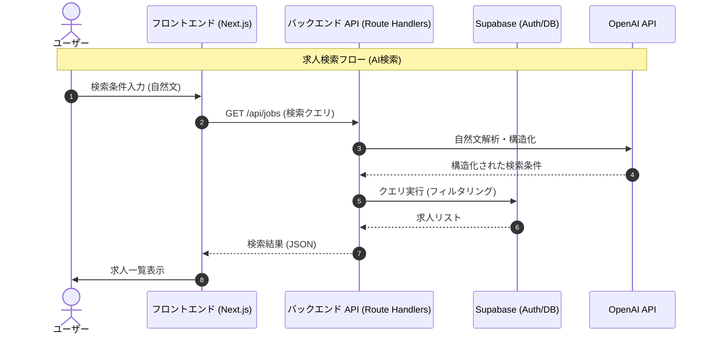

# 求人検索 API 詳細設計

## エンドポイント

`GET /api/jobs`

- **概要**: 求人情報を一覧取得する。
- **パラメータ**: 検索条件をクエリパラメータで受け取る（詳細設計が必要）。

## データフロー

```mermaid
sequenceDiagram
    autonumber
    actor User as ユーザー
    participant Client as フロントエンド (Next.js)
    participant API as バックエンド API (Route Handlers)
    participant Supabase as Supabase (Auth/DB)
    participant AI as OpenAI API

    Note over User, AI: 求人検索フロー (AI検索)
    User->>Client: 検索条件入力 (自然文)
    Client->>API: GET /api/jobs (検索クエリ)
    API->>AI: 自然文解析・構造化
    AI-->>API: 構造化された検索条件
    API->>Supabase: クエリ実行 (フィルタリング)
    Supabase-->>API: 求人リスト
    API-->>Client: 検索結果 (JSON)
    Client->>User: 求人一覧表示
```
