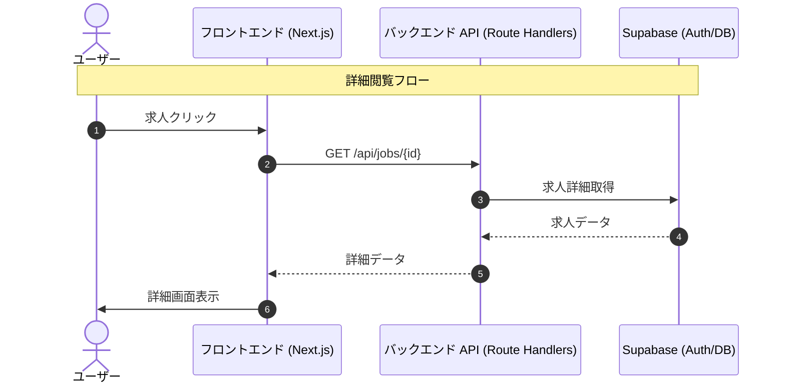

# 求人詳細 API 詳細設計

## エンドポイント

`GET /api/jobs/{id}`

- **概要**: 特定の求人情報の詳細を取得する。

## データフロー

```mermaid
sequenceDiagram
    autonumber
    actor User as ユーザー
    participant Client as フロントエンド (Next.js)
    participant API as バックエンド API (Route Handlers)
    participant Supabase as Supabase (Auth/DB)

    Note over User, Supabase: 詳細閲覧フロー
    User->>Client: 求人クリック
    Client->>API: GET /api/jobs/{id}
    API->>Supabase: 求人詳細取得
    Supabase-->>API: 求人データ
    API-->>Client: 詳細データ
    Client->>User: 詳細画面表示
```
