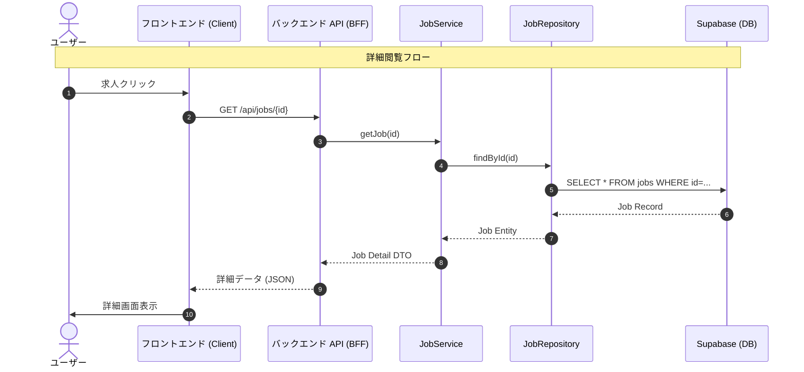

# 求人詳細 API 詳細設計

## エンドポイント

| メソッド | パス | 概要 |
| --- | --- | --- |
| GET | `/api/jobs/{id}` | 求人詳細を取得する。 |
| POST | `/api/jobs/{id}/favorite` | お気に入りに追加する。 |
| DELETE | `/api/jobs/{id}/favorite` | お気に入りから削除する。 |
| GET | `/api/favorites` | 保存した求人一覧を取得する。 |

## レスポンススキーマ (Job Detail)

`/api/jobs/{id}` のレスポンス。

```json
{
  "id": "uuid",
  "title": "Senior Backend Engineer",
  "company": "Global Tech Inc.",
  "location": "Remote (Japan)",
  "salary": "1000万 - 1500万",
  "salary_min": 10000000,
  "salary_max": 15000000,
  "description": "...",
  "requirements": ["Go", "Kubernetes", "AWS"],
  "tags": ["Go", "Cloud"],
  "work_styles": ["Full Remote"],
  "crawled_at": "2024-01-01T12:00:00Z",
  "source_url": "https://example.com/job/123",
  "is_active": true,
  "ai_evaluation": {
    "score": 4.5,
    "reason": "年収が高く、リモートワークが可能であるため。"
  }
}
```

## データフロー (詳細取得)


