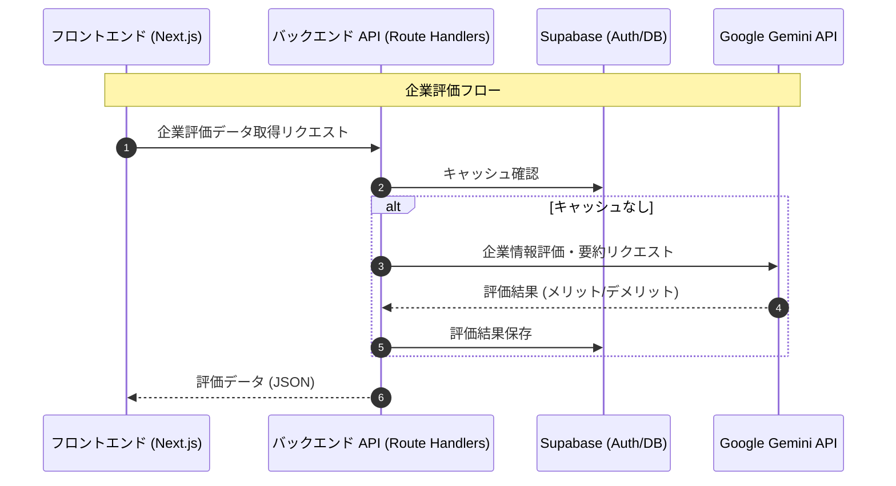

# 企業実態評価 API 詳細設計

## エンドポイント

`GET /api/companies/{id}/evaluation`

- **概要**: 企業の評判や実態評価を取得する。AIによる生成またはキャッシュの返却を行う。

## データフロー



## レスポンススキーマ

AIによって生成され、キャッシュされる評価データの構造。

```json
{
  "summary": "技術力重視の文化があり、若手でも裁量権を持って働ける環境。ただし、部署によっては残業が多い傾向にある。",
  "topics": [
    {
      "category": "Culture",
      "title": "フラットな組織文化",
      "description": "役職に関わらず意見を言いやすい風通しの良い環境。",
      "sentiment": "Positive",
      "sources": [
        { "title": "OpenWork 口コミ", "url": "https://example.com/review/1" },
        { "title": "公式ブログ", "url": "https://example.com/blog/culture" }
      ]
    },
    {
      "category": "Management",
      "title": "トップダウンの経営方針",
      "description": "社長の意向が強く反映される傾向があり、現場の意見が通りにくい場合がある。",
      "sentiment": "Negative",
      "sources": [
        { "title": "転職会議 レビュー", "url": "https://example.com/review/2" }
      ]
    },
    {
      "category": "WorkLifeBalance",
      "title": "有給取得率は高い",
      "description": "特定のアニバーサリー休暇なども整備されており、休みは取りやすい。",
      "sentiment": "Positive",
      "sources": [
        { "title": "採用ページ 福利厚生", "url": "https://example.com/careers/benefits" }
      ]
    }
  ],
  "generated_at": "2024-01-01T12:00:00Z"
}
```

### カテゴリ一覧

- `Culture`: 企業文化、雰囲気 (「仲が良い」「静か」など)
- `Management`: 経営陣、社長、上司の質 (「ワンマン」「尊敬できる」など)
- `WorkLifeBalance`: 残業、休暇、働きやすさ
- `Growth`: 成長環境、研修、キャリアパス
- `Compensation`: 給与、評価制度、福利厚生

## AI プロンプト要件

Gemini へのリクエスト時には以下の制約を設ける。

1. **Source Mapping**: 生成した各トピック (`topics`) について、必ず根拠となった情報の URL を `sources` 配列に含めること。根拠不明な情報は出力しない。
2. **Sentiment Analysis**: 各トピックがポジティブかネガティブか、中立かを判定すること。
3. **Objective Summary**: 冒頭のサマリーは、各トピックの要約とし、個人の主観ではなく客観的な傾向として記述すること。
