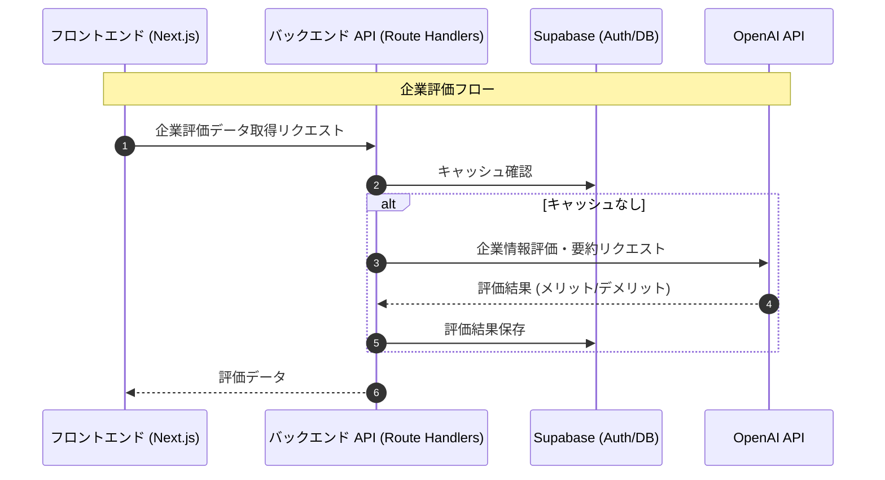

# 企業実態評価 API 詳細設計

## エンドポイント

`GET /api/companies/{id}/evaluation`

- **概要**: 企業の評判や実態評価を取得する。AIによる生成またはキャッシュの返却を行う。

## データフロー

```mermaid
sequenceDiagram
    autonumber
    participant Client as フロントエンド (Next.js)
    participant API as バックエンド API (Route Handlers)
    participant Supabase as Supabase (Auth/DB)
    participant AI as OpenAI API

    Note over Client, AI: 企業評価フロー
    Client->>API: 企業評価データ取得リクエスト
    API->>Supabase: キャッシュ確認
    alt キャッシュなし
        API->>AI: 企業情報評価・要約リクエスト
        AI-->>API: 評価結果 (メリット/デメリット)
        API->>Supabase: 評価結果保存
    end
    API-->>Client: 評価データ
```
