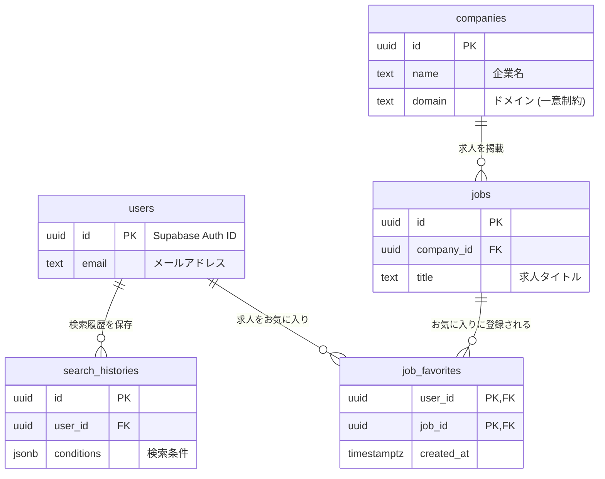

# データベース設計 (Schema)

## 概要

本システムのデータベースは Supabase (PostgreSQL) を使用する。
主要なエンティティは「ユーザー」「求人」「企業」の3つであり、これらを中心に履歴やお気に入り機能が関連付けられる。

## ER図 (Entity Relationship Diagram)

---

## テーブル定義詳細

### 1. `companies` (企業マスタ)

AI検索によって評価された企業情報を管理する。`domain` をユニークキーとして重複を防ぐ。

| カラム名 | データ型 | 制約 | 説明 |
| :--- | :--- | :--- | :--- |
| `id` | `uuid` | PK, Default: `gen_random_uuid()` | 一意な識別子 |
| `name` | `text` | NOT NULL | 企業名 |
| `domain` | `text` | UNIQUE, NOT NULL | 企業のドメイン (e.g. `google.com`)。重複排除に使用。 |
| `tags` | `jsonb` | Default: `[]` | 企業の特徴タグ (e.g. `["Startup", "AI"]`)。 |
| `description` | `text` | | 企業の概要説明。 |
| `logo_url` | `text` | | ロゴ画像のURL。 |
| `created_at` | `timestamptz` | Default: `now()` | 作成日時 |
| `updated_at` | `timestamptz` | Default: `now()` | 更新日時 |

### 2. `jobs` (求人情報)

各企業に紐づく具体的な求人案件。`source_url` をユニークキーとして重複クロールを防ぐ。

| カラム名 | データ型 | 制約 | 説明 |
| :--- | :--- | :--- | :--- |
| `id` | `uuid` | PK, Default: `gen_random_uuid()` | 一意な識別子 |
| `company_id` | `uuid` | FK (`companies.id`), ON DELETE CASCADE | 紐づく企業ID |
| `title` | `text` | NOT NULL | 求人タイトル |
| `location` | `text` | | 勤務地 (e.g. "Tokyo, Remote") |
| `salary_min` | `integer` | | 最低年収 (推定値) |
| `salary_max` | `integer` | | 最高年収 (推定値) |
| `skills` | `jsonb` | Default: `[]` | 必須・歓迎スキルタグ |
| `source_url` | `text` | UNIQUE, NOT NULL | 求人元ページのURL |
| `is_active` | `boolean` | Default: `true` | 求人が現在募集中かどうか |
| `evaluated_at` | `timestamptz` | Default: `now()` | AI評価日時 (鮮度管理に使用) |

### 3. `job_favorites` (お気に入り)

ユーザーが興味を持った求人を保存するための中間テーブル。

| カラム名 | データ型 | 制約 | 説明 |
| :--- | :--- | :--- | :--- |
| `user_id` | `uuid` | PK, FK (`auth.users.id`), ON DELETE CASCADE | ユーザーID |
| `job_id` | `uuid` | PK, FK (`jobs.id`), ON DELETE CASCADE | 求人ID |
| `created_at` | `timestamptz` | Default: `now()` | 追加日時 |

- **PK**: `(user_id, job_id)` の複合主キー。

### 4. `search_histories` (検索履歴)

ユーザーの過去の検索条件を保存する。

| カラム名 | データ型 | 制約 | 説明 |
| :--- | :--- | :--- | :--- |
| `id` | `uuid` | PK, Default: `gen_random_uuid()` | 一意な識別子 |
| `user_id` | `uuid` | FK (`auth.users.id`), ON DELETE CASCADE | ユーザーID |
| `conditions` | `jsonb` | NOT NULL | 検索条件JSON (Search API参照) |
| `summary` | `text` | NOT NULL | 人間可読な要約テキスト |
| `created_at` | `timestamptz` | Default: `now()` | 作成日時 |

- **制約**: アプリケーション側またはトリガーで「1ユーザーあたり最大10件」に制限される。

### 5. `users` (ユーザープロファイル)

Supabase Auth の `auth.users` とは別に、アプリケーション固有のユーザー情報を保持する場合に使用する（現在は Auth に依存しているため、必要に応じて作成）。
*※現状は `auth.users` を直接参照する設計としているが、将来的にプロフィール画像などを管理する場合は `public.profiles` テーブルを作成する。*
